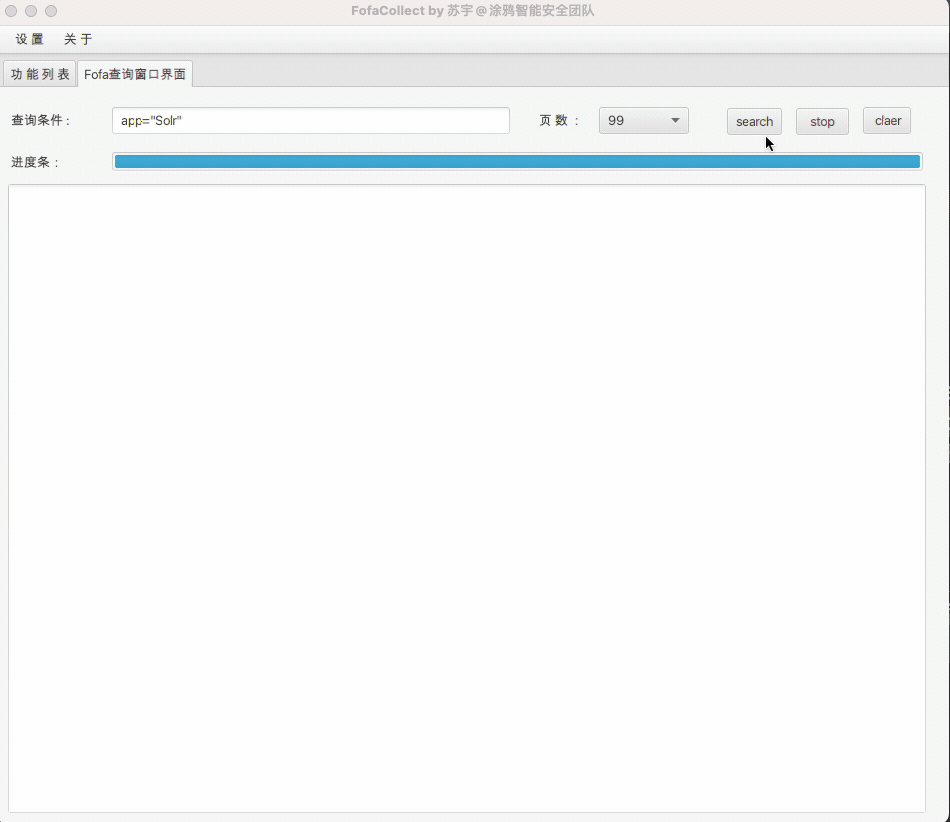

# Fofa-collect


V3.0

支持jdk8直接运行
jdk11因为没有javafx这个依赖需要自己再加上参数 
```
java -Dfile.encoding="UTF-8" --module-path "C:\Program Files\Java\javafx-sdk-11.0.2\lib" --add-modules "javafx.controls,javafx.fxml,javafx.web" -jar "xxx.jar"
```

因为接口问题，删除ip查询功能

增加Fofa采集进度条

公开工具源码



V2.0

增加修改账号配置文件

增加ip批量查询定位


V1.0

提供接口查询资产

最大支持1000页查询

解决页面卡死


